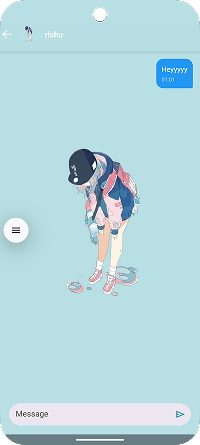

# HeyLoo 💬

A modern Android messaging application built with Firebase, HeyLoo is a modern, real-time chat application built using native Android (Java) ,Firebase, and Cloudinary. It supports user authentication, one-on-one messaging, media sharing, and real-time updates — providing a seamless and responsive chatting experience.


## 📱 About HeyLoo

HeyLoo is a feature-rich messaging application that allows users to connect and communicate in real-time. Built with modern Android development practices and Firebase backend services, it provides a seamless messaging experience with user authentication, profile management, and instant notifications.


## 📱 Screenshots

<p float="left">
  
  &nbsp;&nbsp;&nbsp;
  
  &nbsp;&nbsp;&nbsp;
  
  &nbsp;&nbsp;&nbsp;
  
  &nbsp;&nbsp;&nbsp;
  
  &nbsp;&nbsp;&nbsp;
  
  &nbsp;&nbsp;&nbsp;
  
  &nbsp;&nbsp;&nbsp;
  
</p>

## ✨ Features

### 🔐 Authentication & User Management
- **Firebase Authentication** - Secure user registration and login
- **Profile Management** - Update profile pictures and user information
- **User Discovery** - Browse and connect with other users
- **Session Management** - Automatic login state handling

### 💬 Real-time Messaging
- **Instant Messaging** - Real-time chat with other users
- **Message History** - Persistent chat history using Firebase Firestore
- **Message Deletion** - Delete individual messages
- **User Status** - See when users are online

### 🔔 Push Notifications
- **Firebase Cloud Messaging (FCM)** - Real-time push notifications
- **Local Notifications** - Immediate notification display
- **Custom Notification Handling** - Tap to open specific chats

### 🎨 Modern UI/UX
- **Material Design** - Clean and intuitive interface
- **Navigation Drawer** - Easy access to app features
- **Profile Pictures** - User avatar support with image cropping
- **Splash Screen** - Professional app launch experience
- **Responsive Design** - Optimized for different screen sizes

### 🛠 Technical Features
- **Firebase Integration** - Complete backend solution
- **Image Handling** - Profile picture upload and management
- **Network Optimization** - Efficient data loading and caching
- **Error Handling** - Robust error management and user feedback

## 🏗 Architecture

```
HeyLoo/
├── app/
│   ├── src/main/java/com/harsh/heyloo/
│   │   ├── MainActivity.java          # Main user list and navigation
│   │   ├── MessagingActivity.java     # Chat interface
│   │   ├── LoginActivity.java         # User authentication
│   │   ├── SignUpActivity.java        # User registration
│   │   ├── UpdateProfileActivity.java # Profile management
│   │   ├── SplashActivity.java        # App launch screen
│   │   ├── User.java                  # User data model
│   │   ├── Message.java               # Message data model
│   │   ├── User_Adapter.java          # User list adapter
│   │   ├── MessageAdapter.java        # Message list adapter
│   │   ├── NotificationHelper.java    # Notification management
│   │   └── MyFirebaseService.java     # Firebase messaging service
│   └── src/main/res/                 # UI resources and layouts
└── firebase-functions/                # Backend functions (planned)
```

## 🚀 Getting Started

### Prerequisites

- **Android Studio** (latest version)
- **Java Development Kit (JDK)** 11 or higher
- **Android SDK** API level 24+ (Android 7.0+)
- **Firebase Project** with enabled services

### Installation

1. **Clone the repository**
   ```bash
   git clone https://github.com/yourusername/heyloo.git
   cd heyloo
   ```

2. **Set up Firebase**
   - Create a new Firebase project at [Firebase Console](https://console.firebase.google.com/)
   - Enable Authentication, Firestore Database, and Cloud Messaging
   - Download `google-services.json` and place it in the `app/` directory

3. **Configure Firebase Services**
   - **Authentication**: Enable Email/Password sign-in method
   - **Firestore**: Set up security rules for your database
   - **Cloud Messaging**: Configure FCM for push notifications

4. **Build and Run**
   ```bash
   # Open in Android Studio
   # Sync project with Gradle files
   # Run on device or emulator
   ```

### Firebase Configuration

1. **Authentication Setup**
   ```
   Firebase Console → Authentication → Sign-in method
   Enable Email/Password authentication
   ```

2. **Firestore Database Setup**
   ```
   Firebase Console → Firestore Database → Create database
   Start in test mode for development
   ```

3. **Cloud Messaging Setup**
   ```
   Firebase Console → Project Settings → Cloud Messaging
   Generate and configure FCM server key
   ```

## 🛠 Technologies Used

- **Frontend**: Java, Android SDK
- **Backend**: Firebase (Authentication, Firestore, Cloud Messaging)
- **UI Libraries**: Material Design Components, Picasso (Image Loading)
- **Image Processing**: UCrop (Image Cropping)
- **Networking**: OkHttp, Retrofit
- **Animations**: Lottie

## 📋 Dependencies

```gradle
// Core Android
implementation 'androidx.appcompat:appcompat:1.6.1'
implementation 'com.google.android.material:material:1.11.0'
implementation 'androidx.constraintlayout:constraintlayout:2.1.4'

// Firebase
implementation 'com.google.firebase:firebase-auth:22.3.1'
implementation 'com.google.firebase:firebase-firestore:24.10.2'
implementation 'com.google.firebase:firebase-storage:20.3.0'
implementation 'com.google.firebase:firebase-messaging:23.4.0'

// UI & Utilities
implementation 'androidx.core:core-splashscreen:1.0.0'
implementation 'com.airbnb.android:lottie:6.4.0'
implementation 'com.github.yalantis:ucrop:2.2.10'
implementation 'com.squareup.picasso:picasso:2.8'
implementation 'com.squareup.okhttp3:okhttp:4.12.0'
```

## 🔧 Configuration

### Minimum Requirements
- **Android Version**: 7.0 (API 24) or higher
- **Target SDK**: 34
- **Compile SDK**: 35

### Permissions
- `INTERNET` - For network communication
- `READ_MEDIA_IMAGES` - For profile picture selection (Android 13+)
- `READ_EXTERNAL_STORAGE` - For profile picture selection (Android 12 and below)

## 🚀 Features in Detail

### User Authentication
- Email/password registration and login
- Secure session management
- Automatic login state persistence

### Real-time Messaging
- Instant message delivery using Firebase Firestore
- Message history persistence
- Real-time message updates
- Message deletion functionality

### Profile Management
- Profile picture upload and cropping
- User information editing
- Profile data synchronization

### Push Notifications
- Firebase Cloud Messaging integration
- Local notification fallback
- Custom notification handling
- Background message processing

## 🤝 Contributing

1. Fork the repository
2. Create a feature branch (`git checkout -b feature/AmazingFeature`)
3. Commit your changes (`git commit -m 'Add some AmazingFeature'`)
4. Push to the branch (`git push origin feature/AmazingFeature`)
5. Open a Pull Request

## 📄 License

This project is licensed under the MIT License - see the [LICENSE](LICENSE) file for details.

## 🙏 Acknowledgments

- **Firebase** for providing excellent backend services
- **Material Design** for the beautiful UI components
- **Android Developer Community** for resources and support

## 📞 Support

If you encounter any issues or have questions:

- **Create an issue** on GitHub
- **Check the documentation** in the code comments
- **Review Firebase setup** if experiencing backend issues

## 🔮 Future Enhancements

- [ ] **Voice Messages** - Audio recording and playback
- [ ] **File Sharing** - Document and media sharing
- [ ] **Group Chats** - Multi-user conversations
- [ ] **Message Encryption** - End-to-end encryption
- [ ] **Video Calls** - Real-time video communication
- [ ] **Message Reactions** - Emoji reactions to messages
- [ ] **Dark Mode** - Theme customization
- [ ] **Offline Support** - Message queuing and sync

---

**Made with ❤️ by [Your Name]**

*HeyLoo - Connecting people through meaningful conversations*
